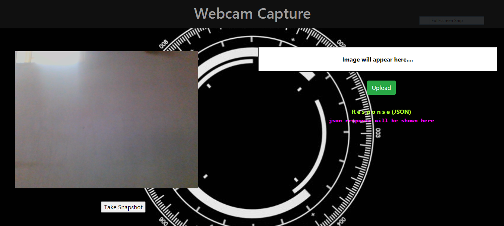
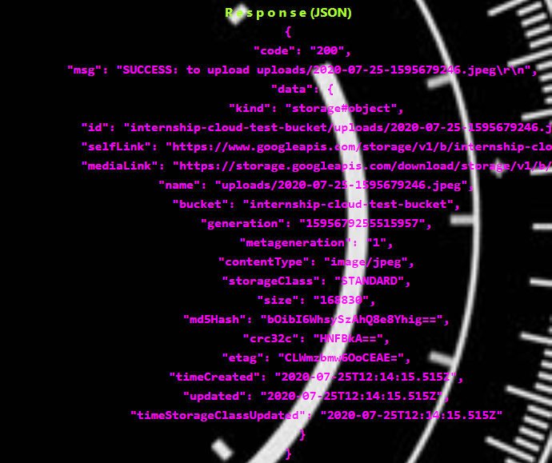

# GCP Webcam Capture using PHP
Web application in which you can take 

picture using webcam and it will be store into Google cloud storage.


To 

upload files on Google Cloud Storage we are going to follow below steps 

:-
<li>Step 1: Create Bucket</li>
<li>Step 2: Make Bucket Public</li>
<li>Step 3: Create Service Account & Download Key</li>
<li>Step 4: 

Install Composer & Download Google Cloud Storage Library</li>
<li>Step 5: Make Code Ready</li>
<li>Step 6: Upload File</li>

<h3>Step 

1: Create Bucket</h3>
First of all we have to create a bucket in which we 

will upload/store our files.
<table>
   <tr>
    <td></td>
    

<td></td>
  

</tr>
</table>
<hr/>

<h3>Step 2: Make Bucket Public</h3>
After creating 

bucket our next step is to making it public so that we can access it’s 

object/files at third party hosting or at localhost.

<hr/>

<h3>Step 3: Create Service Account & 

Download Key</h3>
Our next step is to create service account and 

downloading private key so that we can use that private key to  connect to 

Google Cloud Storage. 
<h5>1.Creating service account</h5>
<table>
   

<tr>
    <td></td>
    <td></td>
  </tr>
</table>

<h5>2.Creating key</h5>

<hr/>

<h3>Step 4: Install 

Composer & Download Google Cloud Storage Library</h3>
Now in this 

step we’ll install Composer (Dependency Manager for PHP). After 

installing composer download Google Cloud Storage Library which we are 

going to use in our code and to download it, we’ll use Terminal (Command 

Line). In command line we’ll create new directory go inside it or we can go 

to our project folder if already created then we’ll run below command.

```
composer require google/cloud-storage
```
After download finishes will have 

a folder called ‘vendor’ containing library files, we don’t need to change 

anything inside it.
<hr/>

<h3>Step 5: Make Code Ready</h3>
I have create 

four php files here config.php, requests.php, index.php, webcam.php and 

will upload file through ajax. Here config.php will contain private key and 

necessary functions, requests.php will use to handle ajax request to upload 

file,webcam.php file containe webcam configration for web browser and 

index.php for introduction page.

1. [Config.php]

(https://github.com/rdtank/gcp-wabcam/blob/master/config.php 

"Config.php")
2. [Requests.php](https://github.com/rdtank/gcp-

wabcam/blob/master/requests.php "requests.php")
3. [index.php]

(https://github.com/rdtank/gcp-wabcam/blob/master/index.php 

"index.php")
4. [webcam.php](https://github.com/rdtank/gcp-

wabcam/blob/master/webcam.php "webcam.php")

<hr/>

<h3>Step 6: 

Upload File</h3>
<h5>Step 1:</h5>

<h5>Step 2:</h5>

<h5>Step 3:</h5>



<hr/>
